# 🧾 Detailed Tutorial: Multi-Signature Escrow Smart Contract
I am Olivier Mwatsimulamo, a student OF Haskell Plutus at EBU... 

This tutorial covers a sophisticated multi-signature escrow smart contract (`PublicFund.hs`) that enables secure fund management with approval workflows. The contract supports deposit locking, official approvals, beneficiary releases, and depositor refunds under specific conditions.

---

## 📚 Table of Contents

🏛️ Architectural Overview  
📦 Imports Overview  
🗄️ Data Structures  
🧠 Core Validator Logic  
⚙️ Validator Script Compilation  
🔌 Off-Chain Implementation  
🔄 Complete Workflow Example  
🧪 Testing Strategy  
✅ Best Practices  
📘 Glossary of Terms  

---

## 1. 🏛️ Architectural Overview

### System Architecture


### Protocol Flow

```mermaid
sequenceDiagram
    participant D as Depositor
    participant O1 as Official 1
    participant O2 as Official 2
    participant B as Beneficiary
    participant V as Escrow Validator
    participant L as Ledger
    
    Note over D,B: Phase 1: Initialization
    D->>V: Initialize Escrow<br/>Deposit: 10 ADA
    V->>L: Create UTxO with Initial State
    
    Note over D,B: Phase 2: Approval Phase (Pre-Deadline)
    O1->>V: Submit Approval #1
    V->>L: Update: Add O1 to Approval Set
    
    O2->>V: Submit Approval #2
    V->>L: Update: Add O2 to Approval Set
    
    Note over D,B: Phase 3: Execution Phase
    alt Sufficient Approvals (≥ Required)
        B->>V: Request Fund Release
        V->>L: Validate: Time ≤ Deadline
        V->>L: Validate: |Approvals| ≥ Required
        V->>L: Validate: Beneficiary Signature
        L->>B: Transfer Funds
    else Insufficient Approvals (Post-Deadline)
        D->>V: Request Refund
        V->>L: Validate: Time > Deadline
        V->>L: Validate: |Approvals| < Required
        V->>L: Validate: Depositor Signature
        L->>D: Return Funds
    end
```



---

## 2. 📦 Imports Overview

### On-Chain Module (`PublicFund.hs`)

**Plutus Foundation Libraries:**
```haskell
import Plutus.V2.Ledger.Api    -- Core Types & Functions
import Plutus.V2.Ledger.Contexts  -- Transaction Validation
import Plutus.V1.Ledger.Interval  -- Time Interval Logic
import PlutusTx                 -- Compilation Framework
```

**Key Components:**
- `Validator` type for script definition
- `ScriptContext` for transaction analysis
- `POSIXTime` for deadline management
- `PubKeyHash` for participant identification

### Off-Chain Module (`Main.hs`)

**Contract Development Suite:**
```haskell
import Plutus.Contract         -- Endpoint & Contract Monad
import Plutus.Trace.Emulator   -- Testing Infrastructure
import Ledger                  -- Address & Transaction Building
import Ledger.Constraints      -- Transaction Constraints
```

**Development Tools:**
- `Contract` monad for wallet interactions
- `Endpoint` for user-facing interfaces
- `EmulatorTrace` for scenario testing

---

## 3. 🗄️ Data Structures

### State Representation (`EscrowDatum`)

```haskell
-- On-Chain State Container
data EscrowDatum = EscrowDatum
    { depositor   :: PubKeyHash      -- Funds Origin
    , beneficiary :: PubKeyHash      -- Funds Destination
    , authorities :: Set PubKeyHash  -- Approval Committee
    , approvals   :: Set PubKeyHash  -- Collected Signatures
    , threshold   :: Integer         -- Minimum Approvals Required
    , expiry      :: POSIXTime       -- Decision Deadline
    }
```

**Design Rationale:**
- `Set` types prevent duplicate entries
- Clear separation of roles and permissions
- Immutable once published to chain

### Action Types (`EscrowAction`)

```haskell
-- Transaction Intent Specification
data EscrowAction
    = Authorize   -- Committee Member Approval
    | Execute     -- Beneficiary Withdrawal
    | Reclaim     -- Depositor Recovery
```

**Semantic Meaning:**
- `Authorize`: Adds committee signature
- `Execute`: Transfers to beneficiary
- `Reclaim`: Returns to depositor

---

## 4. 🧠 Core Validator Logic

### Validation Primitives

```haskell
-- Temporal Constraints
validateTiming :: POSIXTime -> ScriptContext -> ValidationResult
validateTiming deadline ctx
    | txTime <= deadline = BeforeDeadline
    | otherwise          = AfterDeadline
  where
    txTime = intervalEnd (txInfoValidRange (scriptContextTxInfo ctx))

-- Authorization Checks
validateAuthorization :: PubKeyHash -> Set PubKeyHash -> ScriptContext -> Bool
validateAuthorization actor committee ctx =
    actor `member` committee &&
    actor `elem` txInfoSignatories (scriptContextTxInfo ctx)

-- Quorum Verification
validateQuorum :: Set PubKeyHash -> Integer -> Bool
validateQuorum approvals threshold =
    size approvals >= threshold
```

### State Transition Rules

#### **Authorization Transition**
```haskell
preconditions:
  - Current time ≤ expiry deadline
  - Signer ∈ authorities set
  - Signer ∉ approvals set
  - Exactly one signature provided

postconditions:
  - approvals' = approvals ∪ {signer}
  - All other fields unchanged
```

#### **Execution Transition**
```haskell
preconditions:
  - Current time ≤ expiry deadline
  - |approvals| ≥ threshold
  - Beneficiary is transaction signer
  - Output value = initial deposit

postconditions:
  - UTxO consumed, funds transferred
  - Contract terminated
```

#### **Reclamation Transition**
```haskell
preconditions:
  - Current time > expiry deadline
  - |approvals| < threshold
  - Depositor is transaction signer

postconditions:
  - UTxO consumed, funds returned
  - Contract terminated
```

### Complete Validator
```haskell
escrowValidator :: EscrowDatum -> EscrowAction -> ScriptContext -> Bool
escrowValidator datum action context = case action of
    Authorize -> checkAuthorization datum context
    Execute   -> checkExecution datum context
    Reclaim   -> checkReclamation datum context
```

---

## 5. ⚙️ Validator Script Compilation

### Compilation Pipeline

```haskell
-- 1. Type Erasure
untypedValidator :: BuiltinData -> BuiltinData -> BuiltinData -> ()
untypedValidator = mkUntyped escrowValidator

-- 2. Plutus Core Compilation
compiledValidator :: CompiledCode (BuiltinData -> BuiltinData -> BuiltinData -> ())
compiledValidator = $$(compile [|| untypedValidator ||])

-- 3. Validator Creation
escrowScript :: Validator
escrowScript = mkValidatorScript compiledValidator

-- 4. Address Derivation
escrowAddress :: Address
escrowAddress = scriptAddress escrowScript
```

### Serialization Format
```
Validator Hash: sha256(compiledValidator)
Address: scriptHash | validatorHash
Datum: CBOR-encoded EscrowDatum
Redeemer: CBOR-encoded EscrowAction
```

---

## 6. 🔌 Off-Chain Implementation

### Contract Interface

```haskell
-- Service Definition
type EscrowService =
    "initialize" :> ReqBody '[JSON] EscrowParams :> Post '[JSON] TxHash
    :<|> "authorize" :> ReqBody '[JSON] ApprovalRequest :> Post '[JSON] TxHash
    :<|> "execute" :> ReqBody '[JSON] ExecutionRequest :> Post '[JSON] TxHash
    :<|> "reclaim" :> ReqBody '[JSON] ReclamationRequest :> Post '[JSON] TxHash
```

### Client Implementation

#### **Initialization Handler**
```haskell
initializeEscrow :: EscrowParams -> Contract EscrowSchema Text ()
initializeEscrow params = do
    -- Construct Initial State
    let datum = EscrowDatum
            { depositor = params.depositorKey
            , beneficiary = params.beneficiaryKey
            , authorities = Set.fromList params.committeeKeys
            , approvals = Set.empty
            , threshold = params.approvalThreshold
            , expiry = params.decisionDeadline
            }
    
    -- Submit Transaction
    submitTx $ mustPayToTheScript datum $
        lovelaceValueOf params.depositAmount
```

#### **Authorization Handler**
```haskell
submitAuthorization :: ApprovalRequest -> Contract EscrowSchema Text ()
submitAuthorization req = do
    -- Locate Active Escrow
    utxos <- utxosAt escrowAddress
    case findEscrowUTxO utxos req.escrowId of
        Nothing -> throwError "Escrow not found"
        Just (oref, currentDatum) -> do
            -- Validate Authorization Rights
            unless (req.authorizer `member` currentDatum.authorities) $
                throwError "Unauthorized approver"
            
            -- Submit Update
            let redeemer = Authorize
            submitTx $ mustSpendScriptOutput oref redeemer
```

### Monitoring Service
```haskell
-- Escrow State Monitor
monitorEscrows :: Contract EscrowSchema Text ()
monitorEscrows = do
    utxos <- utxosAt escrowAddress
    forM_ utxos $ \(_, datum) -> do
        let remainingTime = datum.expiry - currentTime
            approvalProgress = size datum.approvals
            required = datum.threshold
        
        logInfo $ mconcat
            [ "Escrow Status: "
            , show approvalProgress, "/", show required, " approvals"
            , " | Time remaining: ", show remainingTime
            ]
```

---

## 7. 🔄 Complete Workflow Example

### State Machine Representation

```mermaid
stateDiagram-v2
    [*] --> Created : Initialize with Funds
    Created --> Pending : Lock Successful
    
    state Pending {
        [*] --> AwaitingApprovals
        AwaitingApprovals --> PartiallyApproved : Single Approval
        PartiallyApproved --> FullyApproved : Threshold Met
        AwaitingApprovals --> FullyApproved : Direct to Threshold
    }
    
    Pending --> Executed : Pre-Deadline Release
    Pending --> Reclaimed : Post-Deadline Refund
    
    Executed --> [*]
    Reclaimed --> [*]
    
    note right of Pending
        Transition Constraints:
        - Time ≤ expiry (Execute)
        - Time > expiry (Reclaim)
        - Approvals ≥ threshold (Execute)
        - Approvals < threshold (Reclaim)
    end note
```



### End-to-End Scenario

**Configuration:**
```haskell
escrowConfiguration = EscrowParams
    { depositAmount = 10_000_000  -- 10 ADA
    , depositorKey = pkHash "depositor123"
    , beneficiaryKey = pkHash "beneficiary456"
    , committeeKeys = 
        [ pkHash "official1"
        , pkHash "official2"
        , pkHash "official3"
        ]
    , approvalThreshold = 2  -- 2-of-3 multisig
    , decisionDeadline = 1640995200000  -- Jan 1, 2022
    }
```

**Execution Timeline:**
```
T+0:    Contract Initialization
        - Funds locked at script address
        - Initial state: 0/2 approvals

T+1h:   First Committee Approval
        - Official1 submits authorization
        - State: 1/2 approvals

T+2h:   Second Committee Approval
        - Official2 submits authorization
        - State: 2/2 approvals (threshold met)

T+3h:   Beneficiary Execution
        - Validates: time ≤ deadline ✓
        - Validates: approvals ≥ threshold ✓
        - Validates: beneficiary signature ✓
        - Result: Funds transferred
```

### Alternative Failure Scenario
```
T+0:    Contract Initialization (same as above)

T+1h:   Single Committee Approval
        - State: 1/2 approvals

T+48h:  Deadline Passed
        - Current time > expiry
        - Approvals < threshold

T+49h:  Depositor Reclamation
        - Validates: time > deadline ✓
        - Validates: approvals < threshold ✓
        - Validates: depositor signature ✓
        - Result: Funds returned
```

---

## 8. 🧪 Testing Strategy

### Verification Framework

```haskell
-- Test Suite Structure
data TestScenario = TestScenario
    { setup :: EmulatorTrace ()
    , actions :: [ContractAction]
    , assertions :: [BalanceAssertion]
    , description :: Text
    }

-- Validation Matrix
testMatrix :: [TestScenario]
testMatrix =
    [ TestScenario "Happy Path" happyPathSetup [Approve, Approve, Release] successAssertions
    , TestScenario "Partial Approval Refund" partialSetup [Approve, Wait, Reclaim] refundAssertions
    , TestScenario "Early Refund Attempt" earlySetup [Reclaim] failureAssertions
    , TestScenario "Unauthorized Approval" authSetup [InvalidApprove] failureAssertions
    , TestScenario "Late Execution" lateSetup [Approve, Approve, Wait, Release] failureAssertions
    ]
```

### Property-Based Tests

```haskell
-- Invariant Preservation
prop_noFundsLost :: Property
prop_noFundsLost = monadicIO $ do
    (initial, final) <- run escrowSimulation
    assert $ totalValue initial == totalValue final

-- Authorization Safety
prop_noUnauthorizedAccess :: Property
prop_noUnauthorizedAccess = forAll genEscrowConfig $ \config ->
    forAll genMaliciousActor $ \attacker ->
        cannotAccessFunds attacker config

-- Temporal Safety
prop_noTimeTravel :: Property
prop_noTimeTravel = forAll genTransactionSequence $ \txs ->
    let times = map txTimestamp txs
    in isSorted times ==> allTransactionsValid txs
```

### Integration Tests

```haskell
-- Full System Test
testCompleteWorkflow :: TestTree
testCompleteWorkflow = testGroup "End-to-End Workflow"
    [ testCase "Successful multisig release" testHappyPath
    , testCase "Timeout refund" testTimeoutRefund
    , testCase "Committee rotation" testCommitteeUpdate
    , testCase "Concurrent approvals" testConcurrency
    ]
```

---

## 9. ✅ Best Practices

### Security Architecture

**Defense-in-Depth:**
```haskell
-- Multiple Validation Layers
validateTransaction :: Tx -> ValidationResult
validateTransaction tx =
    checkSignatures tx
    >> checkTiming tx
    >> checkState tx
    >> checkConsensus tx
```

**Principle of Least Privilege:**
- Depositor: Can only reclaim post-deadline
- Committee: Can only authorize (not execute)
- Beneficiary: Can only execute with sufficient approvals

### Code Quality Standards

**Readability:**
```haskell
-- Descriptive Function Names
ensureSufficientApprovals :: Set PubKeyHash -> Integer -> ValidationResult
verifyTransactionSigner :: PubKeyHash -> ScriptContext -> Bool
validateTemporalConstraints :: POSIXTime -> POSIXTime -> ScriptContext -> Bool
```

**Modularity:**
```haskell
-- Separated Concerns
module Validation.Temporal
module Validation.Authorization
module Validation.State
module Validation.Consensus
```

### Performance Optimization

**Gas Efficiency:**
- Use native lists for small sets
- Precompute expensive operations
- Minimize on-chain data storage

**Batch Operations:**
```haskell
-- Combined validation where possible
validateBatch :: [ValidationRule] -> ScriptContext -> Bool
validateBatch rules ctx = all ($ ctx) rules
```

---

## 10. 📘 Glossary of Terms

| Component | Definition | Purpose |
|-----------|------------|---------|
| **Escrow Protocol** | Managed asset custody system | Secure fund holding with conditional release |
| **State Datum** | On-chain data container | Records escrow parameters and progress |
| **Action Redeemer** | Transaction intent specification | Indicates desired state transition |
| **Approval Committee** | Designated signatory group | Provides decentralized authorization |
| **Threshold Scheme** | m-of-n signature requirement | Configurable consensus mechanism |
| **Temporal Boundary** | Decision deadline | Enforces time-based execution constraints |
| **Validation Context** | Transaction environment | Provides execution context for validation |
| **Script Address** | Derived from validator hash | Unique contract identifier on chain |
| **Endpoint Interface** | User interaction point | Off-chain access to contract functionality |
| **Emulation Environment** | Local test framework | Isolated development and testing |

---

## 🎯 Design Principles

### Architectural Tenets
1. **Security First**: Multiple independent validation checks
2. **Transparency**: All state changes recorded on-chain
3. **Flexibility**: Configurable committee sizes and thresholds
4. **Predictability**: Deterministic execution under all conditions
5. **Efficiency**: Minimal on-chain computation and storage

### Protocol Guarantees
- **Fund Safety**: Assets never locked indefinitely
- **Authorization Integrity**: No unauthorized access
- **Temporal Consistency**: Time-based rules strictly enforced
- **State Consistency**: Valid transitions only

---

## 🔗 Reference Implementation

### Repository Structure
```
escrow-contract/
├── src/
│   ├── OnChain/
│   │   ├── Validator.hs      # Core validation logic
│   │   ├── Types.hs          # Data type definitions
│   │   └── Compilation.hs    # Script compilation
│   ├── OffChain/
│   │   ├── Endpoints.hs      # User interfaces
│   │   ├── Client.hs         # Wallet integration
│   │   └── Monitoring.hs     # State observation
│   └── Test/
│       ├── Properties.hs     # Property-based tests
│       ├── Scenarios.hs      # Integration tests
│       └── Emulator.hs       # Trace simulations
├── config/
│   ├── deploy.yaml          # Deployment configuration
│   └── test.yaml           # Test environment setup
└── docs/
    ├── API.md              # Interface documentation
    └── Security.md         # Security considerations
```

### Development Workflow
1. **Design**: Specify escrow parameters and rules
2. **Implement**: Write validator and off-chain code
3. **Test**: Run property-based and integration tests
4. **Audit**: Security review and formal verification
5. **Deploy**: Script compilation and chain deployment
6. **Monitor**: Ongoing observation and maintenance

---

*Note: This implementation follows Cardano's extended UTxO model and Plutus contract framework. Always conduct security audits and extensive testing before production deployment.*
